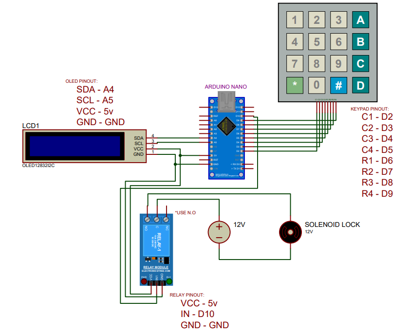

# Simple E-DoorLock

A simple electronic door lock system final project for our internship program, built with Arduino. It uses a keypad for password entry, a solenoid lock for the locking mechanism, and an OLED display for user feedback.

## Features

- 4-digit PIN code to unlock the door
- OLED display shows system status (e.g., "Enter PIN", "Access Granted", "Access Denied")
- Solenoid lock actuation on correct PIN entry
- Easy to customize PIN and wiring

## Hardware Components

| Component | Quantity | Notes |
|---|---|---|
| Arduino Board | 1 | Nano |
| 4x4 Keypad | 1 | |
| Solenoid Door Lock | 1 | 12V Preferably |
| OLED Display | 1 | I2C 0.96' Display |
| Relay Module | 1 | 5v Single Channel |
| DC-DC Buck Converter | 1 | 12v to 5v Step down converter |
| Custom Board | - | Customized for the components |
| Power Supply | 1 | 12v Centralized PSU |

*(Edit this table to match your actual parts list.)*

## Schematic



> Follow the schematic to connect the keypad, OLED, and solenoid (via relay) to the Arduino before uploading the code.

## Installation

1. Clone this repository:
   ```bash
   git clone https://github.com/nashzxc/Simple_E-DoorLock.git
   ```
2. Open the `.ino` file in the [Arduino IDE](https://www.arduino.cc/en/software).
3. Install required libraries (`Wire`, `LiquidCrystal_I2C.h`, `Keypad`, `EEPROM`) via **Sketch > Include Library > Manage Libraries**.
4. Wire your components according to the schematic.
5. Select your board and port under **Tools**, then upload the sketch.


## Usage

1. Power on the device. The OLED will prompt you to **Enter PIN**.
2. Enter your 4-digit password using the keypad.
3. If correct, the solenoid unlocks the door and the OLED displays **Access Granted**.
4. If incorrect, the OLED displays **Access Denied** and prompts you to try again.

### Changing the Default PIN

The default PIN after flashing the firmware is "1234". Update it after uploading to save your new password at the EEPROM:

```cpp
char password[5] = "1234"; // change to your desired 4-digit PIN
```


## Developers
Nash E. Claridad
..
..
..
